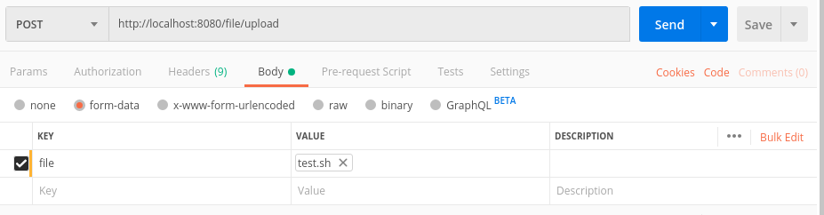

## 平时所有学习demo

### file-server

> 基于springboot 写的一个文件上传和下载服务器

#### 断点续传请求报文需要设置的头部字段

* Range
> 用与请求头中,指定第一个字节的位置和最后一个字节的位置,一般格式:
Range:(unit=first byte pos)-[last byte pos] 例如: Range:bytes=0-99

curl测试命令: curl -i -r 0-99 http://localhost:8080/file/download2/b8ce8f5b93c64c5bb46b873f082bf0c9

#### 断点续传响应报文需要设置的头部字段

* Content-Type: 值为:application/oct-stream
* Content-Disposition: 值为: attachment;filename=文件名
* Accept-Ranges: 值为 bytes 代表以字节为单位

#### 使用postman测试文件上传
> 选择form-data格式 鼠标移动到key中选择file格式

